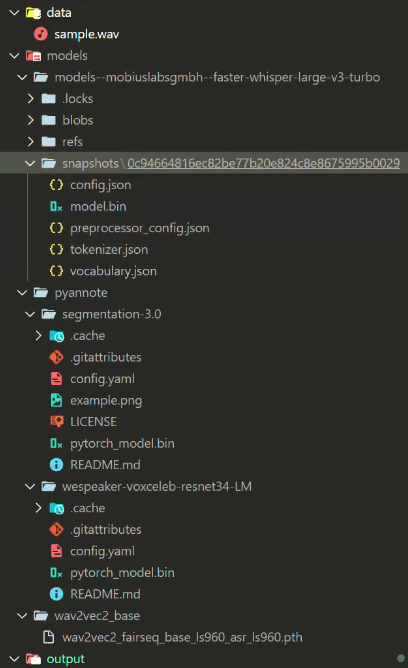

# Offline WhisperX

## Pre-Trained Model(s) Download Links

- [mobiuslabsgmbh/faster-whisper-large-v3-turbo](https://huggingface.co/mobiuslabsgmbh/faster-whisper-large-v3-turbo)
- [pyannote diairzation 3.1](https://huggingface.co/pyannote/speaker-diarization-3.1)
  - [pyannote/wespeaker-voxceleb-resnet34-LM](https://huggingface.co/pyannote/wespeaker-voxceleb-resnet34-LM)
  - [pyannote/segmentation-3.0](https://huggingface.co/pyannote/segmentation-3.0)
- Wav2Vec2 - [PyTorch link](https://download.pytorch.org/torchaudio/models/wav2vec2_fairseq_base_ls960_asr_ls960.pth)

### 模型本地路径


- 或者修改配置到自己指定的路径
```python

MODELS_DIR = r"./models"
WHISPER_MODEL_NAME = "large-v3-turbo"
ALIGN_MODEL_DIR = f"{MODELS_DIR}/wav2vec2_base"
PYANNOTE_CONFIG_PATH = "./pyannote_config.yaml"
...
# change the config as per your requirements
config = TranscriptionConfig(
    whisper_model_name=WHISPER_MODEL_NAME,  # provide whisper model name or path
    whisper_download_root=MODELS_DIR,
    ...
    align_model_dir=ALIGN_MODEL_DIR,
    pyannote_config_path=PYANNOTE_CONFIG_PATH,
```

## required
1. python 3.9.7 (Python 版本太高无法兼容 numpy 版本)
2. whisperx (使用 3.2.0 版本以上，因为低版本需要VAD(Voice Activity Detection) Model，而这个模型作者已经不再提供下载)
```shell
> G:/env/python3.9.7/python -m pip show whisperx
Name: whisperx
Version: 3.3.1
Summary: Time-Accurate Automatic Speech Recognition using Whisper.
Home-page: https://github.com/m-bain/whisperx
Author: Max Bain
Author-email:
License: BSD-2-Clause
Location: g:\env\python3.9.7\lib\site-packages
Requires: pyannote.audio, transformers, pandas, faster-whisper, nltk, setuptools, ctranslate2, torchaudio, torch
Required-by:
```
3. torch  2.5.1+cu121 (torch 版本要和设备 cuda 版本兼容)
```shell
> G:/env/python3.9.7/python -m pip show torch   
Name: torch
Version: 2.5.1+cu121
Summary: Tensors and Dynamic neural networks in Python with strong GPU acceleration
Home-page: https://pytorch.org/
Author: PyTorch Team
Author-email: packages@pytorch.org
License: BSD-3-Clause
Location: g:\env\python3.9.7\lib\site-packages
Requires: fsspec, filelock, networkx, typing-extensions, jinja2, sympy
Required-by: whisperx, torchvision, torchmetrics, torchaudio, torch_pitch_shift, torch-audiomentations, speechbrain, pytorch-metric-learning, pytorch-lightning, pyannote.audio, lightning, julius, asteroid-filterbanks
```
4. numpy 1.23.5
```shell
> G:/env/python3.9.7/python -m pip show numpy 
Name: numpy
Version: 1.23.5
Summary: NumPy is the fundamental package for array computing with Python.
Home-page: https://www.numpy.org
Author: Travis E. Oliphant et al.
Author-email:
License: BSD
Location: g:\env\python3.9.7\lib\site-packages
Requires:
Required-by: transformers, torchvision, torchmetrics, tensorboardX, speechbrain, soundfile, scipy, scikit-learn, pytorch-metric-learning, pytorch-lightning, pyannote.metrics, pyannote.core, pandas, optuna, onnxruntime, matplotlib, lightning, ctranslate2, contourpy, asteroid-filterbanks
```
5. pandas 2.2.2
```shell
> G:/env/python3.9.7/python -m pip show pandas
Name: pandas
Version: 2.2.2
Summary: Powerful data structures for data analysis, time series, and statistics
Home-page: https://pandas.pydata.org
Author:
Author-email: The Pandas Development Team <pandas-dev@python.org>
License: BSD 3-Clause License
        Copyright (c) 2008-2011, AQR Capital Management, LLC, Lambda Foundry, Inc. and PyData Development Team
        ...
Location: g:\env\python3.9.7\lib\site-packages
Requires: python-dateutil, pytz, tzdata, numpy
Required-by: whisperx, pyannote.metrics, pyannote.database
```

## run
```shell
& G:/env/python3.9.7/python.exe g:/project/offline-whisper/offline-whisperx/testing.py
```


## API

1. 安装新的依赖:
```bash
pip install -r requirements.txt
```

1. 启动服务:
```bash
python run_server.py
```

1. API 使用示例:
```python
import requests

url = "http://localhost:8000/transcribe"
data = {
    "audio_path": "path/to/your/audio/file.mp3"
}

response = requests.post(url, json=data)
print(response.json())
```

服务启动后:
- API 文档访问地址: http://localhost:8000/docs
- 可以通过 POST 请求 http://localhost:8000/transcribe 端点来处理音频文件
- 返回结果包含处理时间和输出文件路径

主要特点:
1. 使用 FastAPI 框架提供 RESTful API
2. 保持了原有的转写功能和配置
3. 提供了详细的API文档
4. 包含错误处理
5. 返回处理时间统计
6. 支持异步处理

注意事项:
1. 确保音频文件路径是服务器可访问的
2. 输出文件会保存在 output 目录下
3. 服务默认运行在 8000 端口，可以根据需要修改
4. 建议在生产环境中添加适当的安全措施（如认证）
