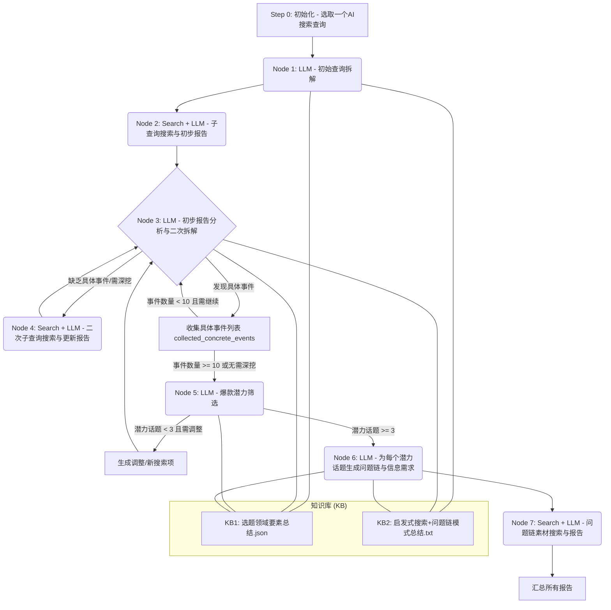

**自动化爆款选题发现与内容框架生成工作流：开发者操作文档**

**版本：** 1.0
**日期：** 2025年5月8日

**1. 工作流目标**

本工作流旨在自动化地从一个初始的、抽象的“AI搜索查询”出发，通过多轮LLM推理、网络搜索和基于知识库的评估，最终筛选出3个以上具有爆款潜力的具体选题，并为每个选题生成详细的“问题链与解答框架”以及相应的素材搜集方向。

**2. 核心工具**

* **大型语言模型 (LLM) Agent节点：** 执行分析、拆解、评估、生成等智能任务。
* **网络搜索节点：** 调用AI搜索引擎API，根据指令获取网络信息。
* **知识库文件 (Knowledge Base - KB):**
    * `KB1: 选题领域要素总结.json` (包含 `topic_types`, `selection_factors`, `entry_methods`, `narrative_techniques`, `summary_insights`, `dominant_emotional_list`, `value_propositions`)
    * `KB2: 启发式搜索+问题链模式总结.txt` (包含“AI搜索启发式综合与扩展”、“‘即用型’AI搜索查询”指令库构建、“文章‘问题链与解答框架’通用模式提炼”、“核心‘辅助信息需求’类型画像”)

**3. 工作流概览 (Conceptual)**



**4. 工作流详细节点说明与LLM提示词**

---

**步骤 0: 初始化**

* **动作:** 开发者编写代码，从`KB2: 启发式搜索+问题链模式总结.txt`文件的“二、‘即用型’AI搜索查询”指令库构建”部分，循环选取一条“即用型AI搜索查询”作为本次工作流的起点。
* **输出:** `initial_ai_search_query` (字符串) - 例如：“帮我搜索最近一周关于“圈层经济的价值外溢与市场重估”相关的现象、案例或讨论。”

---

**节点 1: 初始查询拆解 (LLM Agent)**

* **目的:** 将输入的抽象`initial_ai_search_query`拆解为5-10条更具体、具有指向性的子搜索查询。
* **输入:**
    * `initial_ai_search_query` (字符串)
    * `KB1: 选题领域要素总结.json` (内容作为上下文)
    * `KB2: 启发式搜索+问题链模式总结.txt` (内容作为上下文)
* **输出:** JSON列表，格式: `{"sub_queries": ["子查询1", "子查询2", ...]}`
* **LLM Prompt:**
    ```text
    # 角色: 资深研究分析师，爆款选题策划专家

    # 背景知识库 (已加载):
    # KB1: 选题领域要素总结.json (包含 topic_types, selection_factors 等)
    # KB2: 启发式搜索+问题链模式总结.txt (包含“AI搜索启发式综合与扩展”中的“元概念”和“代表性原始概念示例”等)

    # 任务:
    你收到了一个初始的、相对抽象的AI搜索查询：`{{initial_ai_search_query}}`
    你的目标是仔细分析这个查询，并将其拆解为 5-10 条更具体、更具操作性的子搜索查询。这些子查询将用于后续的网络搜索，以全面收集相关信息。

    # 拆解与思考指引:
    1.  **理解核心概念:** 首先，明确初始查询中核心术语（例如“圈层经济”、“价值外溢”）的定义。如果这些定义是你知识库中已有的或普遍理解的，则无需生成搜索其定义的子查询；如果属于新兴或模糊概念，可以生成搜索其定义的子查询。
    2.  **维度化拆解:** 初始查询通常包含时间限制（如“最近一周”）和期望信息类型（如“现象、案例或讨论”）。你需要针对这些维度生成具体的子查询。
        * **现象类:** 关注市场动态、用户行为变化、新趋势苗头。
        * **案例类:** 关注具体的企业、产品、行业实例或个人经历。
        * **讨论/分析类:** 关注专家见解、媒体评论、学术研究、政策解读、网友热议等。
    3.  **结合知识库进行具象化 (关键步骤):**
        * 参考 `KB2` 中“AI搜索启发式综合与扩展”部分的【元概念】和【代表性原始概念示例】，判断当前 `initial_ai_search_query` 可能关联哪些元概念。
        * 基于此关联，再参考 `KB1` 中的 `topic_types` (选题领域)，将抽象查询具体化到1-2个最相关的领域进行探索。例如，如果初始查询与“技术与平台生态重塑”元概念相关，子查询可以聚焦于AI、社交媒体、电商等具体领域内的现象或案例。
        * 思考初始查询可能触及 `KB1` 中的哪些 `selection_factors` (选题考量因素)，并围绕这些因素（如争议性、信息差、情感共鸣）生成引导性子查询。
    4.  **确保子查询的多样性与覆盖面**，以便从不同角度搜集信息。

    # 示例思路 (仅为启发，请根据实际查询进行分析):
    # 若 initial_ai_search_query 为 "帮我搜索最近一周关于“圈层经济的价值外溢与市场重估”相关的现象、案例或讨论。"
    # 可能的思考与拆解：
    #   - “圈层经济”在哪些具体领域 (参考KB1 topic_types，如“文化与娱乐”、“商业模式”) 的“价值外溢”表现最突出？
    #   - "市场重估" 体现了哪些 "selection_factors" (如反常识、信息差)？
    #   - 子查询可以包括：
    #     - "搜索‘圈层经济’在‘粉丝文化’领域的最新定义和解读"
    #     - "搜索‘价值外溢’在商业分析中的近期应用案例"
    #     - "搜索最近一周‘游戏社群’内虚拟物品‘价值外溢’到现实交易的现象"
    #     - "搜索最近一周关于‘小众品牌’通过‘圈层营销’实现‘市场价值重估’的案例分析"
    #     - "搜索最近一周财经媒体对‘圈层经济导致的市场泡沫或价值重估’的讨论"
    #     - "搜索最近一周社交媒体上关于‘特定圈层消费力外溢影响主流市场’的热议"

    # 输出要求:
    请以JSON格式返回一个包含子查询字符串列表的对象，键为 "sub_queries"。子查询应具体、可执行，并体现上述思考。
    ```

---

**节点 2: 子查询执行与初步报告生成 (网络搜索 + LLM Agent - 可复用)**

* **目的:** 执行Node 1生成的`sub_queries`，获取搜索结果，并由LLM将这些结果初步汇总成一份围绕`initial_ai_search_query`的Markdown报告。
* **输入:**
    * `initial_ai_search_query` (字符串, 用于报告上下文)
    * `sub_queries_result` (来自Node 1的 `{"sub_queries": ["子查询1", ...]}`)
* **子步骤:**
    1.  **搜索执行 (代码):** 循环`sub_queries`列表，对每个子查询调用网络搜索API (AI搜索引擎)，收集返回结果 (如标题、URL、摘要)。
    2.  **报告综合 (LLM Agent):**
        * **LLM输入:** `initial_ai_search_query` (字符串), `search_execution_results` (列表，每项包含`sub_query`及其对应的`search_results`文本片段)。
        * **LLM输出:** `preliminary_report_markdown` (Markdown字符串)。
* **LLM Prompt (用于报告综合):**
    ```text
    # 角色: 高效的研究助理与信息整合员

    # 背景:
    你已经接收到了一系列子查询及其对应的网络搜索结果片段。这些子查询都是为了探索一个更上层的初始AI搜索查询。

    # 初始AI搜索查询 (上下文):
    `{{initial_ai_search_query}}`

    # 子查询及搜索结果片段 (输入):
    # (这里会传入一个结构化数据，例如：
    # [
    #   {"sub_query": "子查询1", "results": ["结果片段1.1", "结果片段1.2"]},
    #   {"sub_query": "子查询2", "results": ["结果片段2.1"]},
    #   ...
    # ]
    # )
    `{{search_execution_results}}`

    # 任务:
    请基于以上所有子查询及其搜索结果，围绕最初的 `{{initial_ai_search_query}}` 主题，生成一份结构清晰、信息凝练的初步搜索报告。

    # 报告撰写要求:
    1.  **结构化:** 报告应以 `{{initial_ai_search_query}}` 作为总标题或引言。主体内容可以按照每个 `sub_query` 分节，清晰展示该子查询及其相关的核心搜索发现。
    2.  **信息提炼:** 对每个子查询的搜索结果进行筛选、去重、总结。提取最相关、最有价值的信息点。避免直接罗列原始结果。
    3.  **关联性:** 确保总结的内容紧密围绕子查询本身，并最终服务于理解 `{{initial_ai_search_query}}`。
    4.  **客观准确:** 基于搜索到的信息进行总结，避免过度解读或加入未经验证的个人观点。
    5.  **格式:** 使用Markdown格式。子查询可以用作小标题。

    # 输出示例 (Markdown格式):
    # ## 探索：帮我搜索最近一周关于“圈层经济的价值外溢与市场重估”相关的现象、案例或讨论。
    #
    # ### 子查询1: 搜索‘圈层经济’在‘粉丝文化’领域的最新定义和解读
    # - 根据搜索结果，近期观点认为粉丝文化中的圈层经济体现在...
    # - 相关讨论指出其主要特征为...
    #
    # ### 子查询2: 搜索最近一周‘游戏社群’内虚拟物品‘价值外溢’到现实交易的现象
    # - 观察到XX游戏社群近期出现...
    # - 案例：某玩家通过...
    #
    # ... (其他子查询结果)
    ```

---

**节点 3: 初步报告分析与二次拆解 (LLM Agent)**

* **目的:** 分析Node 2生成的`preliminary_report_markdown`，判断是否已包含足够的具体事件/案例。若不足，则结合知识库对尚不清晰的方面进行更深层次的、更具象化的子问题拆解，以指导下一轮搜索。
* **输入:**
    * `initial_ai_search_query` (字符串, 上下文)
    * `preliminary_report_markdown` (来自Node 2)
    * `collected_concrete_events` (列表，初始为空，在循环中累积已发现的具体事件描述)
    * `KB1: 选题领域要素总结.json`
    * `KB2: 启发式搜索+问题链模式总结.txt`
* **输出:** JSON对象，格式:
    ```json
    {
        "newly_found_concrete_events": ["在当前报告中新识别的具体事件描述1", "..."],
        "updated_collected_concrete_events": ["累积的所有具体事件描述..."],
        "further_sub_queries": ["更具体的二次子查询1", "..."], // 若需深挖
        "needs_further_drilling": true // 或 false
    }
    ```
* **LLM Prompt:**
    ```text
    # 角色: 资深调查记者，深度分析专家

    # 背景知识库 (已加载):
    # KB1: 选题领域要素总结.json (包含 topic_types, selection_factors, dominant_emotional_list 等)
    # KB2: 启发式搜索+问题链模式总结.txt (包含“核心‘辅助信息需求’类型画像”等)

    # 初始AI搜索查询 (顶层上下文):
    `{{initial_ai_search_query}}`

    # 当前已收集的具体事件列表 (可能为空):
    `{{collected_concrete_events}}`

    # 上一轮搜索生成的初步报告 (Markdown):
    `{{preliminary_report_markdown}}`

    # 任务:
    1.  **分析报告，识别具体事件:** 请仔细阅读 `{{preliminary_report_markdown}}`。判断其中是否包含可被视为“具体事件”的信息。
        * “具体事件”通常指：涉及明确的实体（公司、产品、人物）、具体的时间点或时间段、可描述的发生过程或结果、可验证的数据点等。
        * 将新识别出的具体事件简要描述，并添加到 `newly_found_concrete_events` 列表中。

    2.  **判断是否需要进一步深挖:**
        * 综合当前 `{{preliminary_report_markdown}}` 的信息深度和 `{{collected_concrete_events}}` 的累积数量，判断是否还需要进一步的具象化搜索以找到更多、更深入的具体事件。目标是围绕 `{{initial_ai_search_query}}` 收集足够多的高质量具体案例/事件。

    3.  **生成二次子查询 (如果需要深挖):**
        * 如果判断需要进一步深挖 (`needs_further_drilling: true`)，请基于 `{{preliminary_report_markdown}}` 中尚不清晰、缺乏细节或有潜力挖掘更具体案例的部分，并**深度结合 `KB1` 和 `KB2`**，生成 5-10 条更具象化、更窄聚焦的二次子查询。
        * **具象化指引 (关键步骤):**
            * **参考 `KB1` 的 `topic_types`**: 如果初步报告提到了某个抽象现象，思考这个现象在哪些更细分的领域（如 `KB1` 中的具体行业、特定人群）可能有具体体现？
            * **参考 `KB1` 的 `selection_factors` 和 `dominant_emotional_list`**: 思考初步报告中哪些点可能引发强烈情感或具有高讨论度，围绕这些点生成追问式、探究原因或寻找佐证的子查询。
            * **参考 `KB2` 的“核心‘辅助信息需求’类型画像”**: 思考初步报告中缺失了哪些关键信息类型（如用户评论、专家观点、具体数据），生成弥补这些信息缺口的子查询。
            * **针对性**: 二次子查询应比第一次的子查询更具体，例如，从“搜索圈层经济现象”深化到“搜索近期XX品牌利用YY圈层文化进行营销的具体案例及用户反馈”。
        * 如果当前报告已足够深入或已收集足够事件，则 `further_sub_queries` 可为空列表，`needs_further_drilling` 为 `false`。

    # 输出要求:
    请以JSON格式返回结果。
    ```

---

**节点 4: 二次子查询执行与报告更新 (复用节点2的逻辑)**

* **目的:** 执行Node 3生成的`further_sub_queries`，获取搜索结果，并由LLM将这些新结果整合成一份更新的报告。
* **输入:**
    * `initial_ai_search_query` (字符串, 上下文)
    * `further_sub_queries_result` (来自Node 3的 `{"further_sub_queries": ["二次子查询1", ...]}`)
* **输出:** `updated_report_markdown` (Markdown字符串)
* **实现:** 调用与节点2相同的LLM Prompt和搜索执行逻辑，但输入为`further_sub_queries`及其搜索结果。输出的报告可以是对上一份报告的补充，或者是一份全新的、更深入的报告。为简化，这里假设它生成一份新的、更聚焦的报告。

---

**循环 A (节点3与节点4的迭代)**

* **控制逻辑 (代码):**
    1.  初始化 `master_collected_concrete_events = []`。
    2.  执行Node 3，获得其输出。将`newly_found_concrete_events` 添加到 `master_collected_concrete_events`。
    3.  如果Node 3输出的 `needs_further_drilling` 为 `true` 且 `len(master_collected_concrete_events) < 10` (且未达最大循环次数)，则将其 `further_sub_queries` 传递给Node 4执行，Node 4的输出 `updated_report_markdown` 作为下一次Node 3的输入。
    4.  循环直到 `len(master_collected_concrete_events) >= 10` 或 `needs_further_drilling` 为 `false` 或达到最大循环次数。
* **最终产出:** `master_collected_concrete_events` (列表) 和最后一次生成的报告。

---

**节点 5: 爆款潜力筛选 (LLM Agent)**

* **目的:** 分析 `master_collected_concrete_events` 列表中的每个事件，结合`KB1`中的爆款特征，筛选出3个以上具有高传播、高讨论潜力的选题。如果不足3个，尝试对其他事件进行维度调整，给出新的搜索建议。
* **输入:**
    * `master_collected_concrete_events` (列表)
    * `KB1: 选题领域要素总结.json` (作为核心评估标准)
* **输出:** JSON对象，格式:
    ```json
    {
        "high_potential_topics": [ // 描述高潜力话题的字符串或对象列表
            {"topic_description": "事件1描述", "reasoning": "符合KB1中XX因素...", "score": 0.9},
            ...
        ],
        "queries_for_adjustment_or_new_search": ["调整后的搜索建议1", "..."], // 若高潜力话题不足3个
        "needs_more_potent_topics": true // 或 false
    }
    ```
* **LLM Prompt:**
    ```text
    # 角色: 顶级内容策略师，爆款孵化专家

    # 背景知识库 (已加载):
    # KB1: 选题领域要素总结.json (包含 selection_factors, dominant_emotional_list, value_propositions, summary_insights 等爆款特征)

    # 输入:
    # 已收集的具体事件列表:
    `{{master_collected_concrete_events}}`

    # 任务:
    1.  **评估爆款潜力:** 请仔细评估列表中的每一个事件，依据 `KB1` 中的爆款特征对其进行筛选。重点考察：
        * 是否符合多个 `selection_factors` (如时效性、普遍性、反常识、信息差、情感驱动、争议性等)？
        * 是否能引发 `dominant_emotional_list` 中列举的强烈情绪？
        * 是否能提供 `value_propositions` 中描述的核心价值？
        * 是否与 `summary_insights` 中揭示的爆款规律相符？
        * **为每个事件给出一个潜力评估理由和可选的潜力分值 (0-1)。**

    2.  **筛选高潜力选题:** 选出至少3个评估后具有高爆款潜力的选题。

    3.  **生成调整/新搜索建议 (如果高潜力选题不足3个):**
        * 如果筛选出的高潜力选题少于3个，请分析其余事件的不足之处（例如，在哪些爆款要素上得分较低）。
        * 然后，针对这些不足，尝试对这些事件的探索方向进行维度上的调整，或基于它们派生出新的、更有潜力的搜索查询建议。这些建议应旨在找到更符合爆款特征的信息。例如：
            * 如果一个事件有事实但缺乏情感共鸣，新查询可以加入情感向的关键词或指向特定人群。
            * 如果一个事件比较陈旧，新查询可以关注其近期发展或类似模式的新案例。

    # 输出要求:
    请以JSON格式返回结果。`high_potential_topics` 列表中的每个对象应包含事件描述、评估理由和可选分值。
    ```

---

**循环 B (节点3、4、5的迭代，可选)**

* **控制逻辑 (代码):**
    1.  如果Node 5输出的 `needs_more_potent_topics` 为 `true` 且未达最大调整次数。
    2.  将其 `queries_for_adjustment_or_new_search` 作为新的 `initial_ai_search_query` 或 `further_sub_queries` 输入到循环A的起点(Node 1或Node 3，取决于查询的抽象程度)或直接到Node 4。
    3.  重复循环A和Node 5，直到筛选出至少3个高潜力选题或达到最大调整次数。
* **最终产出:** 至少3个 `high_potential_topics`。

---

**节点 6: 为高潜力选题生成问题链与内容框架 (LLM Agent)**

* **目的:** 对筛选出的每个高潜力选题（约3个），结合`KB1`和`KB2`，生成详细的“问题链与解答框架”，并列出为解答这些问题所需要搜索的具体信息。
* **输入 (对每个高潜力选题单独调用此LLM Agent):**
    * `one_high_potential_topic` (来自Node 5的 `high_potential_topics` 中的一项)
    * `KB1: 选题领域要素总结.json` (特别是 `entry_methods`, `narrative_techniques`)
    * `KB2: 启发式搜索+问题链模式总结.txt` (特别是“文章‘问题链与解答框架’通用模式提炼”和“核心‘辅助信息需求’类型画像”)
* **输出 (对每个选题):** JSON对象，格式:
    ```json
    {
        "topic_analyzed": "{{one_high_potential_topic.topic_description}}",
        "question_chain_framework_description": "此处为LLM生成的详细问题链描述，例如：'本文将首先通过XX引入，接着探讨YY现象的深层原因，分析其对ZZ的多方影响，并最终提出AA的思考或解决方案...'。",
        "question_chain_details": [
            {
                "question": "核心问题1 (例如：这个现象是如何发生的？)",
                "answer_focus": "解答此问题应侧重于梳理事件的起因、发展脉络...",
                "information_needed_queries": [
                    "搜索“{{one_high_potential_topic 相关关键词}}”的背景资料和时间线",
                    "搜索关于“{{one_high_potential_topic 相关人物/机构}}”的近期动态和声明"
                ]
            },
            {
                "question": "核心问题2 (例如：这背后的根本原因是什么？)",
                "answer_focus": "解答此问题应深入分析其经济、社会、心理等多层面因素...",
                "information_needed_queries": [
                    "搜索专家对“{{one_high_potential_topic}}”背后机制的解读和评论",
                    "搜索与“{{one_high_potential_topic}}”相关的统计数据或研究报告"
                ]
            },
            ...
        ],
        "suggested_entry_method": "根据KB1 entry_methods推荐一个切入方式",
        "suggested_narrative_techniques": ["根据KB1 narrative_techniques推荐几个叙事技巧"]
    }
    ```
* **LLM Prompt:**
    ```text
    # 角色: 金牌内容策划与架构师

    # 背景知识库 (已加载):
    # KB1: 选题领域要素总结.json (包含 entry_methods, narrative_techniques)
    # KB2: 启发式搜索+问题链模式总结.txt (包含“文章‘问题链与解答框架’通用模式提炼”的框架1、2、3，以及“核心‘辅助信息需求’类型画像”)

    # 当前高潜力选题:
    `{{one_high_potential_topic.topic_description}}`
    # (可选) 该选题的爆款潜力评估理由:
    `{{one_high_potential_topic.reasoning}}`

    # 任务:
    针对以上高潜力选题，你的目标是构建一个深度文章的“问题链与解答框架”。这个框架将引导后续的内容创作和素材搜集。

    # 构建指引:
    1.  **选择核心框架:** 参考 `KB2` 中“文章‘问题链与解答框架’通用模式提炼”部分，为当前选题选择一个最合适的通用框架（例如：框架1: 现象/争议 -> 溯源与机制 -> 多维影响 -> 结论/展望）。在 `question_chain_framework_description` 中简述你选择的框架以及如何应用于本选题。
    2.  **设计核心问题链 (`question_chain_details`):**
        * 基于所选框架，设计 3-5 个核心的、层层递进的问题，构成文章的主线逻辑。
        * 对每个问题，在 `answer_focus` 中简要说明解答该问题时应侧重的分析方向或内容要点。
        * **关键：** 对每个问题，在 `information_needed_queries` 中列出 2-3 条具体的、可执行的AI搜索查询。这些查询应旨在获取解答该问题所需的核心信息。设计这些查询时，请参考 `KB2` 中“核心‘辅助信息需求’类型画像”（如用户评论、官方数据、专家观点等），确保查询能够导向所需类型的辅助信息。查询应包含与当前选题相关的关键词。
    3.  **建议切入方式与叙事技巧:**
        * 参考 `KB1` 中的 `entry_methods`，为这个选题建议一个或多个合适的引入方式，填入 `suggested_entry_method`。
        * 参考 `KB1` 中的 `narrative_techniques`，为这个选题建议几个核心的叙事技巧，填入 `suggested_narrative_techniques` 列表。

    # 输出要求:
    请严格以JSON格式返回结果。确保 `information_needed_queries` 中的查询具体且与对应问题高度相关。
    ```

---

**节点 7: 问题链素材搜索与报告 (网络搜索 + LLM Agent - 新建节点)**

* **目的:** 对Node 6中每个高潜力选题生成的`information_needed_queries`执行搜索，并将结果汇总成结构化的“素材报告”，直接对应问题链中的每个问题。
* **输入 (对Node 6输出的每个选题框架单独调用此LLM Agent):**
    * `topic_framework` (Node 6输出的完整JSON对象)
* **子步骤:**
    1.  **搜索执行 (代码):** 遍历 `topic_framework.question_chain_details` 中每个问题的 `information_needed_queries` 列表，对每个查询调用网络搜索API，收集结果。
    2.  **素材报告综合 (LLM Agent):**
        * **LLM输入:** `topic_framework.topic_analyzed` (字符串), `topic_framework.question_chain_details` (包含问题、解答焦点和原始查询), 以及与每个原始查询对应的`search_results`文本片段。
        * **LLM输出:** `content_material_report_markdown` (Markdown字符串)。
* **LLM Prompt (用于素材报告综合):**
    ```text
    # 角色: 专业研究员，内容素材组织专家

    # 背景:
    你正在为一个高潜力选题准备内容创作所需的素材。已经有了一个明确的“问题链与解答框架”，以及为解答每个问题而设计的具体搜索查询和相应的网络搜索结果。

    # 选题分析框架 (输入):
    # topic_analyzed: `{{topic_framework.topic_analyzed}}`
    # question_chain_details:
    # (这里会传入一个结构化数据，例如：
    # [
    #   {
    #     "question": "核心问题1",
    #     "answer_focus": "解答焦点1...",
    #     "information_needed_queries": ["原始查询1.1", "原始查询1.2"],
    #     "search_results_for_query_1_1": ["结果片段A", "结果片段B"],
    #     "search_results_for_query_1_2": ["结果片段C"]
    #   },
    #   ...
    # ]
    # )
    `{{structured_input_with_questions_and_search_results}}`

    # 任务:
    请基于以上输入，为选题 `{{topic_framework.topic_analyzed}}` 生成一份结构化的“内容素材报告”。这份报告应清晰地将搜索到的信息与问题链中的每个问题对应起来，为内容创作者提供直接可用的素材。

    # 素材报告撰写要求:
    1.  **紧扣问题链:** 报告的主体结构应严格按照 `question_chain_details` 中的问题顺序和内容进行组织。
    2.  **素材对应:** 对每个核心问题，提炼并展示从其对应的 `information_needed_queries` 的搜索结果中找到的最相关、最有价值的信息点。
    3.  **信息质量:** 优先选取事实、数据、权威观点、典型案例或有代表性的用户评论。对信息进行适当筛选和浓缩。
    4.  **辅助解答焦点:** 总结的素材应能直接服务于对应问题的 `answer_focus`。
    5.  **引用来源 (如果可用):** 如果搜索结果中包含明确的来源信息 (如新闻标题、网站名)，请酌情标注。
    6.  **格式:** 使用Markdown格式。每个核心问题作为一级或二级标题。

    # 输出示例 (Markdown格式):
    # # 素材报告：{{topic_framework.topic_analyzed}}
    #
    # ## 问题1: {{question_chain_details[0].question}}
    # **(解答焦点: {{question_chain_details[0].answer_focus}})**
    #
    # **相关素材与信息点:**
    # - (来自 "{{question_chain_details[0].information_needed_queries[0]}}"):
    #   - 搜索结果显示...
    #   - 数据表明...
    # - (来自 "{{question_chain_details[0].information_needed_queries[1]}}"):
    #   - 专家观点认为...
    #   - 案例：XYZ公司...
    #
    # ## 问题2: {{question_chain_details[1].question}}
    # **(解答焦点: {{question_chain_details[1].answer_focus}})**
    # ...
    ```

---

**步骤 11: 最终报告汇总 (代码)**

* **动作:** 开发者编写代码，将工作流各个阶段产生的所有关键信息和报告汇总成一个大的文档。
    * 初始AI搜索查询 (`initial_ai_search_query`)
    * 第一轮拆解的子查询 (`sub_queries` from Node 1)
    * 初步/更新的搜索报告 (Markdown from Node 2 / Node 4)
    * 收集到的所有具体事件列表 (`master_collected_concrete_events`)
    * 筛选出的高潜力选题列表及其评估理由 (JSON from Node 5)
    * 针对每个高潜力选题：
        * 问题链与解答框架 (JSON from Node 6)
        * 内容素材报告 (Markdown from Node 7)
* **输出:** 一份综合性的选题策划与研究报告文档。
